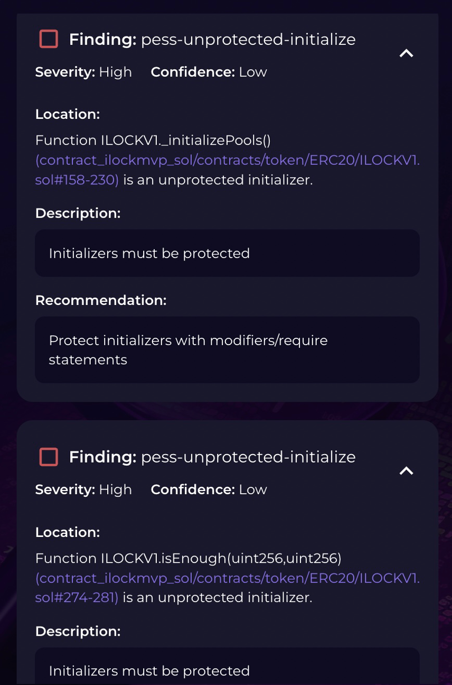
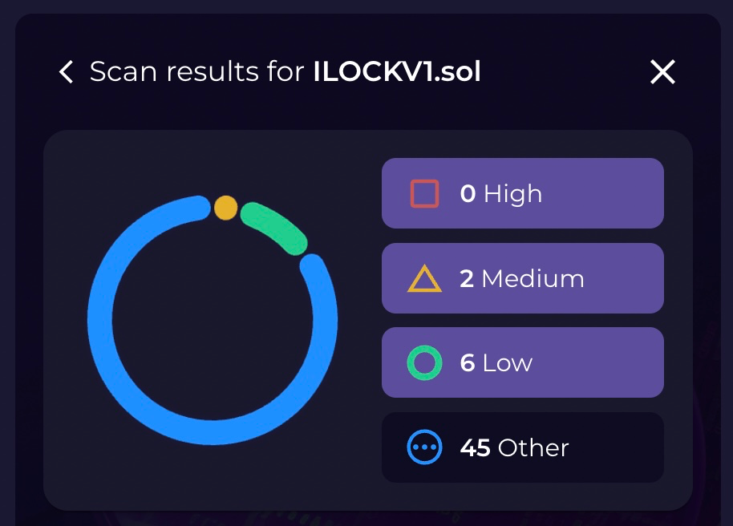
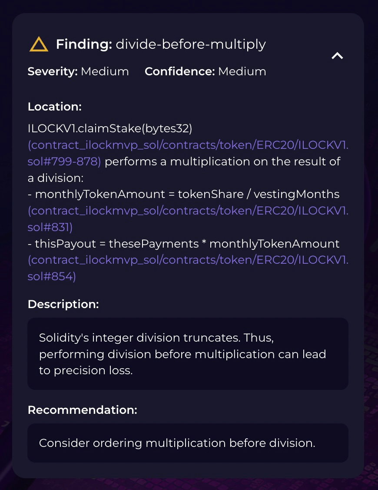
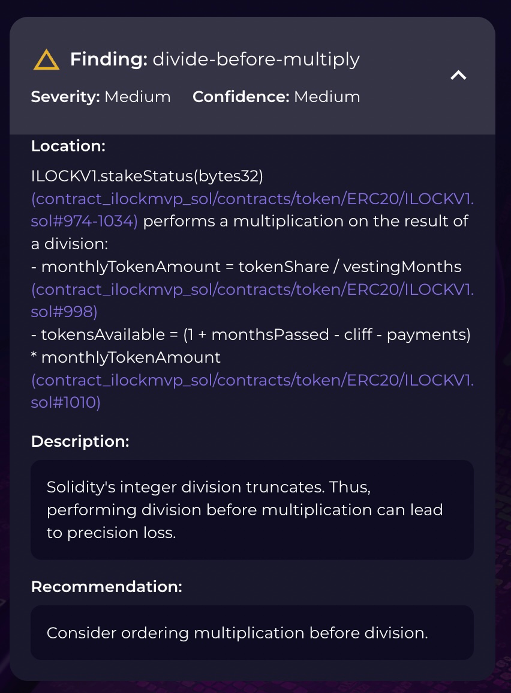
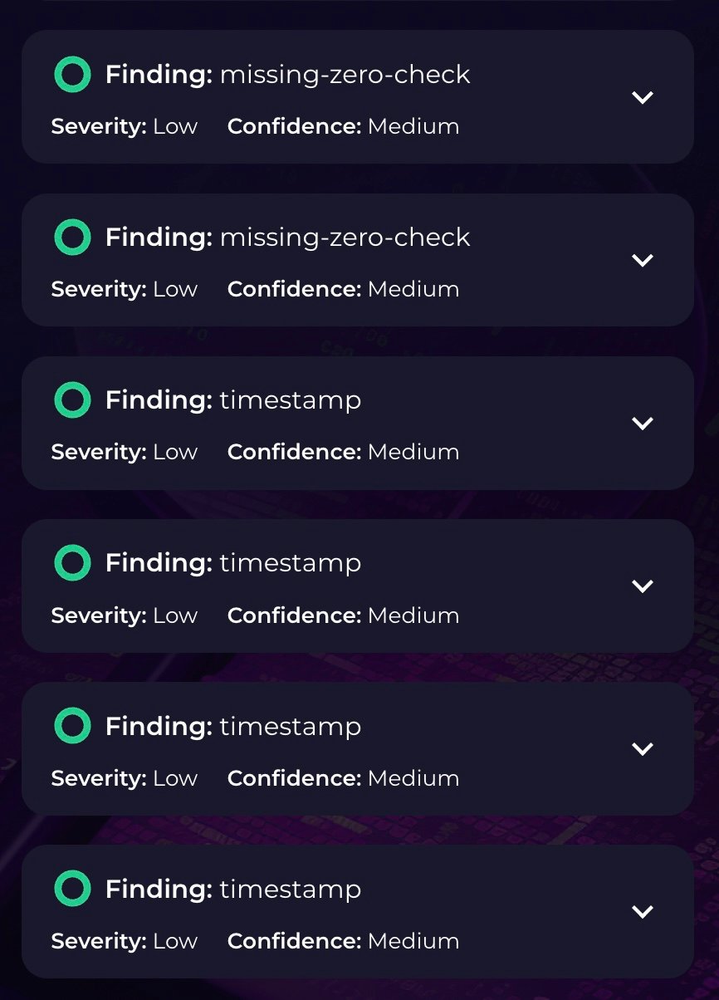
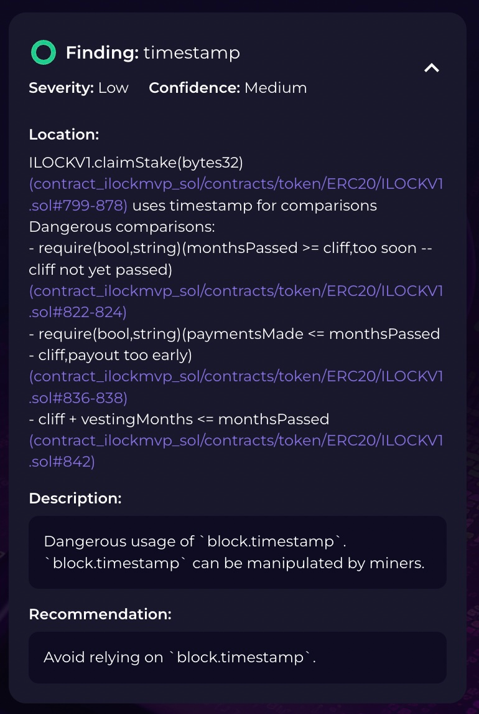
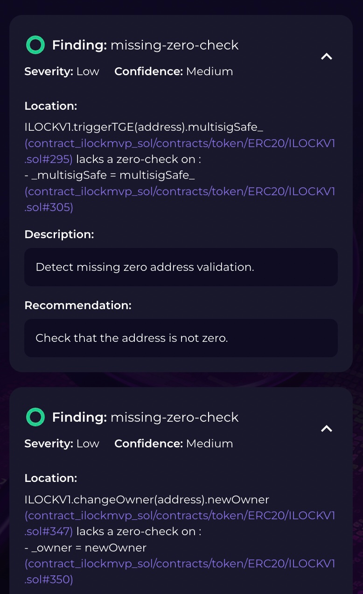

# Audit Wizard ILOCKmvp Solidity Contract Audit

This report involves a self-audit on the ILOCK solidity contract originally intended for Aribrum One Mainnet.

The tool used in this audit is [Audit Wizard](https://www.auditwizard.io).

This report outlines findings, refutations, and conclusions determined by the process of reviewing for and addressing issues in the contract.

## Initial Scan:

Contract initial condition, commit: [600754e59986d3bef3c3b87b2ddc8f144bf193bc](https://github.com/interlock-network/interlock-smartcontracts/commit/600754e59986d3bef3c3b87b2ddc8f144bf193bc).

Initially there was one valid high severety finding, and two invalid. The valid finding was an upgradeable storage field withing the `UpgradeableContext.sol` file that conflicted with the `ILOCKV1.sol` `__gap` field. To address this, the `__gap` was removed from `UpgradeableContext.sol`. This as per commit: [1010f048a3606bef6ba8d57787d04b8038d03ae7](https://github.com/interlock-network/interlock-smartcontracts/commit/1010f048a3606bef6ba8d57787d04b8038d03ae7).

The invalid findings were statements that the contract initializer is not protected. This is not true, and attempts to reinitialize the contract after deployment consistently fail. These are the invalid high-severity findings:



These findings were caused by the [Slitherin Detectors](https://github.com/pessimistic-io/slitherin/). The next scan (with the Slitherin Detectors turned off) omitted th erroneous findings.

## Second Scan:



### The two medium-severity findings concern arithmetic safety:





Solidity's integer division is [floor division](https://docs.soliditylang.org/en/v0.8.21/types.html#division), meaning it rounds toward zero. In the case of `ILOCKVx`, this is a non-issue because the rounding error is accounted for in the final month of token distribution. If there is any token left due to rounding, this modulo is added to the final month's payment, see:

```solidity
        // if at final payment, add remainder of share to final payment
        if (tokenShare - tokensPaidOut - tokensAvailable < monthlyTokenAmount && tokensAvailable > 0) {
            
            tokensAvailable += tokenShare % vestingMonths; }
```
and
```solidity
        // if at final payment, add remainder of share to final payment
        if (tokensRemaining - thisPayout < monthlyTokenAmount) {
            
            thisPayout += tokenShare % vestingMonths; }
```
These two medium-severity findings are disregarded.

**NOTE:** _Actually_, these two medium severity findings were resolved when enforving ^0.8.18 solidity compiler.

### The remaining findings are low-severity:



#### We can disregard the timestamp findings:



The use of `block.timestamp` in the `ILOCKVx` token contract is insensitive to the risk of miners manipulating the timestamp. The worst that a malicious miner could accomplish in manipulating the timestamp is issue that month's payout early for a stakeholder. Due to the nature of how payout time calculated, a malicious miner would need to manipulate the block timestamp by 30 days to get an _extra_ payout ahead of schedule, which is simply impossible.

#### We can address the zero address findings:



We add the `noZero()` modifier to `changeOwner` and `triggerTGE` functions to resolve these two low-severity findings, per commit: [497ab1171d5c8d7819a043206fd1e3e7a05724eb](https://github.com/interlock-network/interlock-smartcontracts/commit/497ab1171d5c8d7819a043206fd1e3e7a05724eb).

## Informational findings:

The informational findings break down into categories:

- assembly
- pragma
- dead-code
- solc-version
- low-level-calls
- naming-convention
- redundant-statements
- similar-names

solc-version findings were resolved by upgrading the solidity compiler to ^0.8.18 for all files in contract tree, commit: [89a44b3c5e3ad7956083257ba9a543a9f2ec1625](https://github.com/interlock-network/interlock-smartcontracts/commit/89a44b3c5e3ad7956083257ba9a543a9f2ec1625).

**MORE TO COME**
