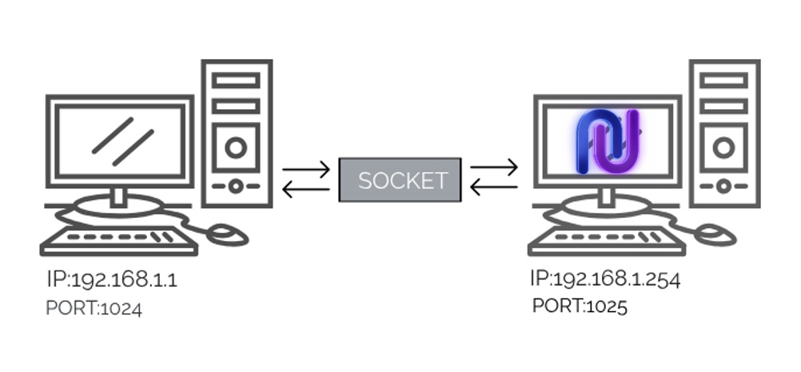

# Port/Socket Application Template

The port/socket application is a formalism -- and abstraction -- drawn from the world of computer networking. The purpose of this formalism is to provide a clear way of thinking about how arbitrary smart contracts may interface with the $ILOCK PSP22 token contract in the forseeable future.

The formalism itself represents an interface scheme. This scheme is purposfully designed to allow verified and approved smart contract applications to use select internal or only-owner functionalities of the Interlock token contract. Verified and approved smart contracts interfacing with the Interlock token contract will only have access to features and functionalities allowed in the verification process.

This is effectively a way to extend the concept of a 'transfer approval' (thus the functionality of `transfer_from()`) to operations more complex than a simple transfer. For example, the first application to interface with the Interlock token contract is the Universal Access NFT. This NFT allows callers to mint NFTs in exchange for $ILOCK, without a transaction relay.

### The formalism:

An application contract is owned by an operator. A different instance of this same application contract may be owned by a different operator. All applications of a specific type interface with the Interlock token contract via a _**port**_. A port specifies specific internal logic within the token contract that an application contract has access to when it makes a call. It also specifies the unique codehash of the valid connecting application contract's code. If the previously approved application has been altered in any way, the port will reject any attempts for it to connect to the token contract.

Each combination of an application's port and an application contract's owner/operator is that we call a _**socket**_, specified in an address:port format. That is, a socket is like the connection from our token contract to an owner operator who may be running several different instances of an application contract at once. A given application's access to the token contract through the single socket is therefore multiplexed by the blockchain itself, as any application's cross-contract socket call on the Interlock token contract's port is atomic.

### Consider the following example schematic diagram, to help clear up some confusion:

We could try to be _strictly_ true to the TCP/IP formalism and think of each application as having it's own socket ($ILOCK token address : application number), but this is overly complicated, perhaps reserved for future, more advanced design.

The bottom line is that this abstraction is meant to help think of smart contracts in terms of a _computer_. A port is traditionally associated with a particular protocol or logic. This is what ports on the $ILOCK token contract do. Computers also have the ability to accept or reject incoming socket connections on a port. Sockets identify a host with a port. Different hosts (running applications) interact with different ports on the computers they connect to.

The ultimate value in this formalism is to create a consistent and familiar way to network smartcontracts as if they were computers, like a smart contract internet so to speak. The ultimate purpose of this formalism is to reduce or eliminate the need for off-chain transaction relays.

## [Please review the Universal Access NFT as a working reference implementation, here.](../contract_uanft/)

## How to get setup and build:

#### See [[DOCUMENTATION]](https://interlock-network.github.io/interlock-smartcontracts/contract_application/docs/application/).

## How to test on testnet: 

##### To deploy a contract to testnet, `upload metadata.json` and `ilockmvp.wasm` (in `target`) to [testnet.alephzero.org](https://testnet.alephzero.org).
