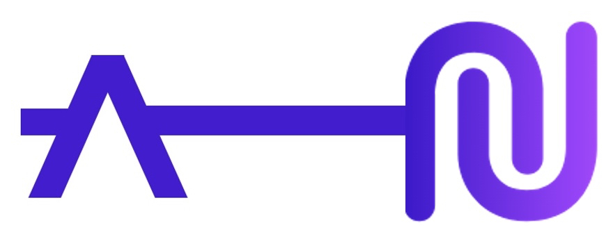

### [(Visit this link to explore the demo Universal Access NFT CLI application.)](https://github.com/interlock-network/universal-access-nft-demo)

# Universal Access NFT (Sponsored by Aleph Zero)

The Interlock Universal Access NFT is a scheme for licensing and managing access permissions via ownership of a PSP34 NFT. **This project is sponsored by the [Aleph Zero](https://alephzero.org) Grant Program and is intended to provide this licensing/access scheme as a general framework to the Aleph Zero community at large.** The NFT used in this project is compatible with the [Art Zero](https://artzero.io) marketplace.

#### Implementing this system in production presumes knowledge of the following:
 - [PSP43 NFT standard (ERC721)](https://github.com/w3f/PSPs/blob/master/PSPs/psp-34.md)
 - [ink! 4](https://use.ink/4.0.0/)
 - [openbrush 3](https://docs.openbrush.io)
 - [Polkadot{.js}](https://polkadot.js.org/docs/)

#### Possible Universal Access NFT applications:
 - api key management
 - two factor authentication
 - software licensing
 - general secret verification

As this is a _general_ framework, it will be up to you to create your own UI frontend. To experience a minimal application of a Universal Access NFT, get started with the demonstration CLI app linked at the top of this page.
